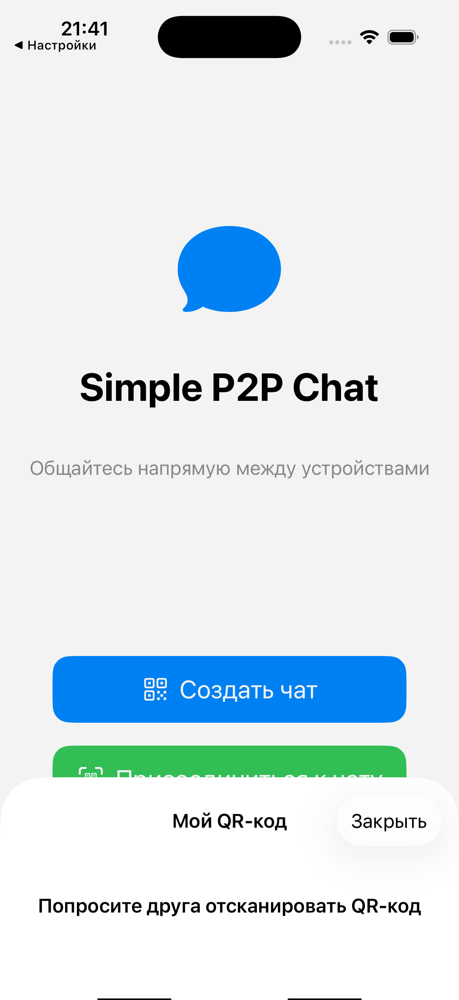
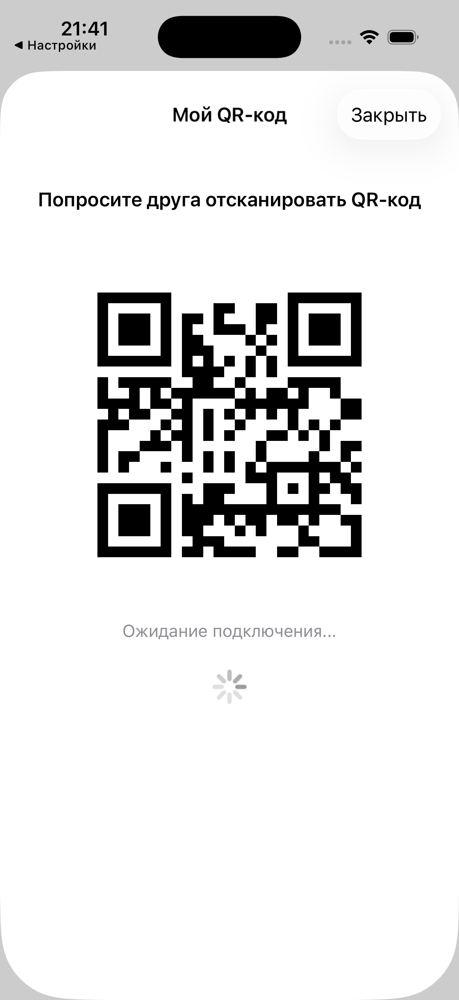
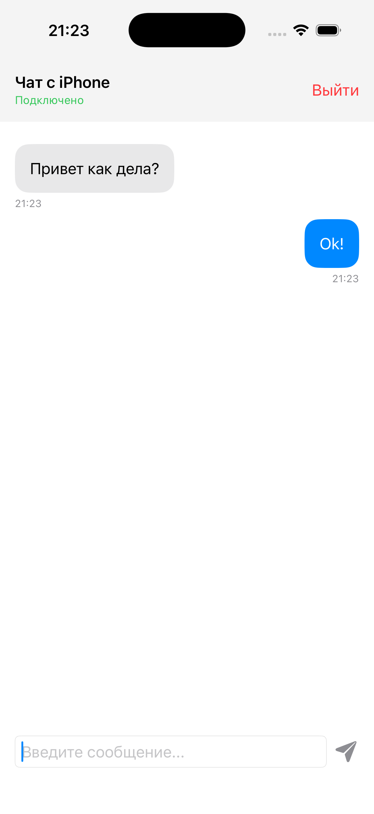

📱 Simple P2P Chat
Общайтесь напрямую, без серверов. Просто, безопасно, по Wi-Fi.

 

Простой и элегантный мессенджер, который устанавливает прямое Peer-to-Peer (P2P) соединение между устройствами iPhone по локальной сети Wi-Fi. Ваши сообщения остаются между вами.

✨ Как это работает
Приложение использует мультипирровый фреймворк от Apple для обнаружения nearby устройств и установления безопасного P2P-канала. Обмен данными происходит напрямую, минуя какие-либо облачные серверы.

Создайте чат – Ваше устройство генерирует уникальный QR-код.

Присоединитесь – Друг сканирует этот код своей камерой.

Общайтесь! – Соединение установлено, можно обмениваться сообщениями.

🖼️ Скриншоты приложения
Экран приветствия   Ваш QR-код для подключения  Живой чат

Выберите действие: создать чат или присоединиться к существующему.	Покажите этот код другу для быстрого подключения.	Чистый интерфейс, история сообщений с временем.
🚀 Возможности
Прямое соединение (P2P): Сообщения передаются напрямую между устройствами по Wi-Fi.

Процесс подключения в 1 клик: Просто отсканируйте QR-код.

Без регистрации и серверов: Не нужен аккаунт, телефон номер или интернет.

Современный интерфейс: Нативный iOS-дизайн, чистый и интуитивно понятный.

Безопасность: Соединение зашифровано средствами фреймворка Apple.

🛠️ Технический стек
Язык: Swift 5.9

UI: SwiftUI

P2P-фреймворк: MultipeerConnectivity

Минимальная версия iOS: 17.0

Архитектура: MVVM

📦 Установка и запуск
Клонируйте репозиторий:

bash
git clone https://github.com/nettramp/SimpleP2PChat/simple-p2p-chat.git
Откройте проект SimpleP2PChat.xcodeproj в Xcode 15 или новее.

Выберите устройство или симулятор (на симуляторе тестирование P2P ограничено).

Нажмите Cmd + R для сборки и запуска.

Важно: Для полноценного тестирования связи между устройствами вам понадобятся два физических iPhone с iOS 17+, подключенные к одной сети Wi-Fi.

🎯 Использование
Запустите приложение на двух устройствах.

На одном устройстве нажмите "Создать чат". Появится экран с QR-кодом.

На втором устройстве нажмите "Присоединиться к чату". Откроется сканер камеры.

Наведите камеру второго устройства на QR-код первого.

Готово! После установки соединения начните обмен сообщениями.

👨‍💻 Разработка
Этот проект является отличным примером для изучения:

Работы с фреймворком MultipeerConnectivity.

Построения современного UI на SwiftUI.

Реализации MVVM-архитектуры в Swift.

Интеграции сканера QR-кодов (VisionKit).

Вклад в проект приветствуется! Feel free to fork и отправлять pull requests.

📄 Лицензия
Этот проект распространяется под лицензией MIT. См. файл LICENSE для получения дополнительной информации.

🤝 Контакты
Ваше имя или название команды - @your_twitter - email@example.com

Ссылка на проект: https://github.com/nettramp/SimpleP2PChat/

Сделано с ❤️ на SwiftUI.

